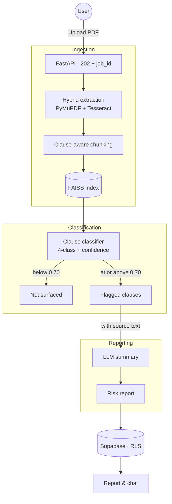

# ⚖️ LegalMind — AI Contract Risk Analyzer

[](https://legalmind-frontend-eight.vercel.app)


A document-intelligence backend that turns a contract PDF into a reviewable risk report:
hybrid OCR ingestion, clause-aware chunking, local vector retrieval, clause classification,
and a generated summary — served behind an asynchronous job API with per-user data isolation.

**[Try the live app →](https://legalmind-frontend-eight.vercel.app)**

---

## What this system does

Contract review is slow because the risky clauses are buried in boilerplate. LegalMind
extracts every clause, classifies it, and returns the risky ones **with the source text
attached**, so a reviewer can verify rather than trust.

The design constraint throughout: a legal tool that cannot show its evidence is not useful.
Every flagged risk carries the clause it came from.

## Pipeline

```
PDF upload
  → 202 Accepted + job_id
  → [background worker]
       hybrid extraction   PyMuPDF, falling back to Tesseract OCR by text density
       clause chunking     section/clause boundaries, not fixed character counts
       embeddings          all-MiniLM-L6-v2, local CPU — no text leaves the host
       retrieval index     FAISS, per document
       classification      4-class clause risk, batched
       threshold + persist Supabase, row-level security per user
  → GET /api/v1/job/{id} → completed + structured findings
```

### 1. Hybrid ingestion

Contracts arrive as clean digital PDFs and as scans. The extractor measures text density
per page and falls back to Tesseract OCR only where the text layer is missing, so scanned
documents work without paying OCR cost on every file.

### 2. Clause-aware chunking

Contracts are hierarchical — `Section 4.2(b)(iii)` is meaningless without `Section 4`.
Fixed-size splitting breaks clauses mid-obligation and produces classifications on
fragments. Chunking follows the document's own clause and section boundaries so every unit
classified is a complete provision.

Clauses longer than the 512-token model limit are split and aggregated by maximum risk,
which biases toward flagging.

### 3. Local retrieval

`sentence-transformers/all-MiniLM-L6-v2` runs on CPU and FAISS holds the index in-process.
Both choices are deliberate: **no contract text is sent to a third-party embedding API.**
For confidential commercial documents that constraint outranks raw retrieval quality.

### 4. Risk classification

Clause-level classification into four categories — Safe/Standard, Unilateral Termination,
Unlimited Liability, Non-Compete — with a confidence score per clause. Findings below 0.70
confidence are not surfaced.

That threshold is a precision/recall trade, and it is currently set toward precision.
For a risk detector that is arguably backwards — a missed liability clause costs more than
a false flag a reviewer dismisses in seconds. A review tier for low-confidence hits is the
right fix and is not built yet.

### 5. Asynchronous job API

Classifying every clause in a contract takes seconds to minutes on CPU. That cannot be held
open on an HTTP request: proxies time out, a blocking call inside an `async def` handler
stalls the event loop for every other user, and a failed request cannot be resumed.

So upload returns **202 Accepted** with a `job_id`, work happens outside the request cycle,
and the client polls `GET /api/v1/job/{id}`.

**Current implementation is FastAPI `BackgroundTasks`** — same process, no persistence, no
retry. Adequate for demo traffic and honestly not more than that: a job dies with the
worker, and job state is per-process, so more than one worker breaks status polling.
Moving to a real queue (Redis + a worker pool) with job state in Postgres is the first
production change.

### 6. Persistence and isolation

Supabase provides Postgres, object storage, and auth. Documents and analyses are protected
by **row-level security policies keyed on `auth.uid()`**, so isolation is enforced by the
database rather than by application code that a future endpoint might forget to apply.
The browser holds only the anon key; the service-role key never leaves the server.

---

## API

| Method | Endpoint | Purpose |
|---|---|---|
| `POST` | `/api/v1/upload` | Accepts a PDF, starts the pipeline, returns `202` + `job_id` |
| `GET` | `/api/v1/job/{job_id}` | Job status: `pending` / `completed` / `failed` |
| `GET` | `/api/v1/document/{id}` | Structured findings with confidence scores and source clauses |
| `POST` | `/api/v1/chat` | Context-grounded Q&A over the document's retrieved chunks |

Interactive docs at `/docs` when running locally.

---

## Stack

**Backend** (`/legalmind-backend`)
- **API** — FastAPI, Pydantic models, dependency injection
- **Extraction** — PyMuPDF with Tesseract OCR fallback
- **Orchestration** — LangChain, Hugging Face `transformers`
- **Embeddings** — `all-MiniLM-L6-v2`, CPU
- **Vector search** — FAISS, in-process
- **Classifier** — [`abhishek-3740/legalmind-clause-classifier`](https://huggingface.co/abhishek-3740/legalmind-clause-classifier), a Legal-BERT + DeBERTa-v3 ensemble trained by my teammate Nikhil; I built the serving integration
- **Data** — Supabase (Postgres + storage + auth, with RLS)

**Frontend** (`/legalmind-frontend`)
- React + Vite, deployed on Vercel

---

## Architecture



---

## Local setup

**Backend**

```bash
cd legalmind-backend
python -m venv venv
source venv/bin/activate          # Windows: venv\Scripts\activate
pip install -r requirements.txt
# create .env with Supabase URL, anon key, and service-role key
python main.py                    # http://localhost:8000 · docs at /docs
```

**Frontend**

```bash
cd legalmind-frontend
npm install
npm run dev                       # http://localhost:5173
```

---

## Limitations

Stated plainly, because a legal tool that hides its failure modes is worse than no tool.

- **Four risk categories only.** Anything outside the taxonomy is forced into one of them.
  **Absence of a flag is not evidence of absence of risk.**
- **Single-worker deployment.** Job state and the FAISS index are per-process.
- **`BackgroundTasks`, not a queue.** Jobs do not survive a restart and are not retried.
- **Confidence scores are uncalibrated.** The 0.70 threshold assumes they are meaningful;
  that is untested for this ensemble.
- **Not legal advice.** A triage aid for prioritising human review, nothing more.

## Roadmap

1. Redis-backed queue with job state in Postgres; multi-worker safe.
2. Low-confidence review tier instead of a hard cut.
3. Probability calibration before thresholding.
4. Per-class recall surfaced to the user rather than a single accuracy figure.
5. Retrieval evaluated separately from generation — recall@k on a labelled query set.
