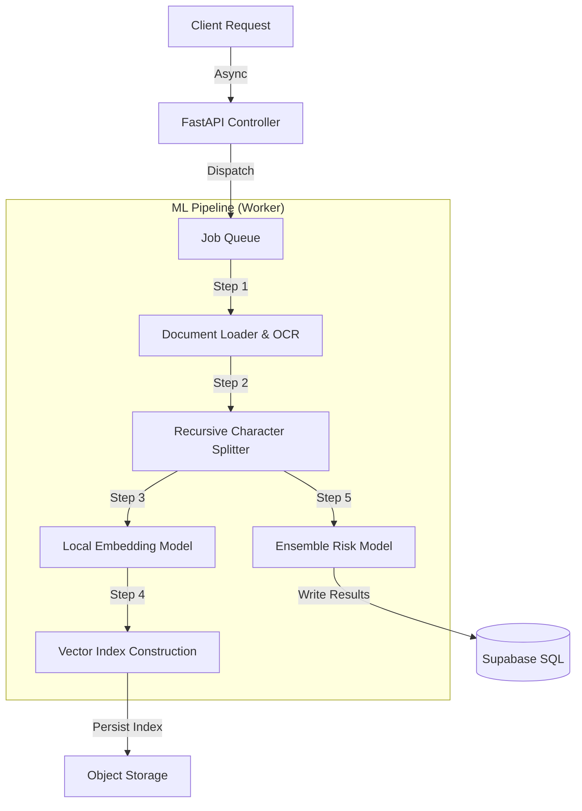

# ⚖️ LegalMind: AI Contract Risk Analyzer


**LegalMind** is a high-performance backend system designed for automated contract analysis. It orchestrates a complex **3-stage AI pipeline** involving OCR, Vector Search (RAG), and Ensemble Classification to detect legal risks with **97.74% accuracy**.

While it includes a minimal React frontend for demonstration, the core value lies in its **robust API architecture, asynchronous task management, and custom ML pipelines**.

---

## 🚀 Backend Architecture & Features

### **1. Advanced AI Pipeline**
The system implements a custom ingestion pipeline using **LangChain** and **PyMuPDF**:
* **Hybrid OCR Engine:** Intelligently switches between text extraction and OCR (Tesseract) based on document density.
* **Ensemble Risk Detection:** A proprietary classification model combining **Legal-BERT** and **DeBERTa** architectures to flag specific clauses (e.g., *Unlimited Liability*, *Unfair Termination*).
* **Local RAG System:** Uses `sentence-transformers/all-MiniLM-L6-v2` (running on CPU) and **FAISS** for zero-latency, private vector search.

### **2. Asynchronous Job Processing**
* Built on **FastAPI BackgroundTasks** to handle long-running ML inference without blocking API response times.
* Implements a polling pattern (`/job/{id}`) for client-side status updates.

### **3. Scalable Data Infrastructure**
* **Vector persistence:** FAISS indices are serialized and backed up to cloud storage.
* **Supabase Integration:** Acts as a managed PostgreSQL + Storage layer to persist transaction logs, chat history, and document metadata.

---

## 🛠️ Technical Stack

### **Core Backend (`/legalmind-backend`)**
* **API Framework:** FastAPI (Pydantic models, Dependency Injection)
* **ML Orchestration:** LangChain, Hugging Face `transformers`
* **Vector Database:** FAISS (Local in-memory speed)
* **Embeddings:** `all-MiniLM-L6-v2` (Optimized for CPU inference)
* **Storage & DB:** Supabase (PostgreSQL)

### **Frontend Utility (`/legalmind-frontend`)**
* *Minimal UI built with React & Vite to visualize the API outputs.*

---

## ⚡ API Architecture

The system exposes a RESTful API designed for scalability. Key endpoints include:

### **Pipeline Control**
* `POST /api/v1/upload` - Initiates the asynchronous ingestion pipeline.
    * *Payload:* PDF Binary
    * *Process:* OCR -> Chunking -> Embedding -> Risk Classification -> Storage
* `GET /api/v1/job/{job_id}` - Polling endpoint for pipeline status.

### **RAG & Inference**
* `POST /api/v1/chat` - Context-aware QA using retrieved vector chunks.
* `GET /api/v1/document/{id}` - Returns structured risk analysis and model confidence scores.

---

## 🏗️ System Design

The architecture follows a modular, event-driven pattern to ensure separation of concerns between Ingestion, Inference, and Storage.



## 📦 Local Setup

### **1. Backend Environment (Primary)**
```bash
cd legalmind-backend

# Create virtual environment
python -m venv venv
source venv/bin/activate  # Windows: venv\Scripts\activate

# Install ML & API dependencies
pip install -r requirements.txt

# Configure Environment
# Create .env with Supabase credentials
```

### **2. Run the Engine**
```bash
python main.py

# The high-performance API starts on http://localhost:8000
# API Documentation available at http://localhost:8000/docs
```


### **3. Frontend **
```bash
cd legalmind-frontend

# Install Node dependencies
npm install

# Start development server
npm run dev

# UI runs on http://localhost:8080 (or 5173)
```